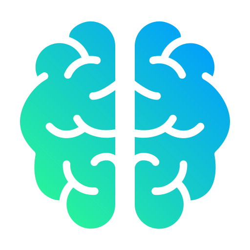
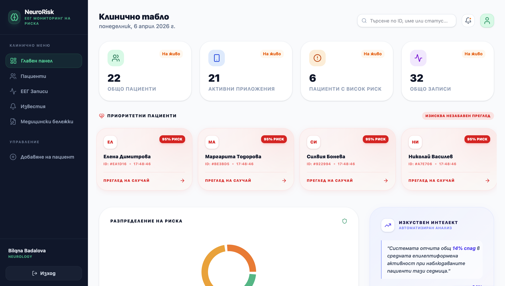
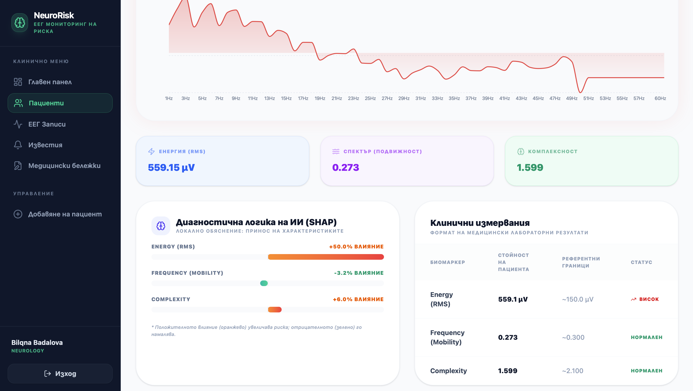

<div align="center">

# 🧠 NeuroRisk
**AI-БАЗИРАН МОНИТОРИНГ НА ЕЕГ РИСК**

---

# 🚀 Технологичен стек


> *Интелигентна екосистема за live мониторинг и превантивна реакция. Комбинация от AI алгоритми, облачна инфраструктура и потребителски интерфейс, която превръща суровия мозъчен сигнал в спасяваща информация.*



</div>

---

## 📑 Съдържание
1. [Въведение и Мотивация](#-въведение-и-мотивация)
2. [Архитектура на системата](#-архитектура-на-системата)
3. [Изкуствен интелект и Машинно обучение](#-изкуствен-интелект-и-машинно-обучение)
4. [Ключови функционалности](#-ключови-функционалности)
5. [Инсталация и локално стартиране](#-инсталация-и-локално-стартиране)
6. [Бъдещо развитие](#-бъдещо-развитие)

---


## 🎯 Въведение и Мотивация
В световен мащаб над 50 милиона души живеят с епилепсия, като за голяма част от тях основното предизвикателство е непредсказуемостта на пристъпите. Липсата на инструменти за мобилен мониторинг в реално време често води до закъсняла медицинска помощ и постоянен стрес за пациентите и техните близки.

**NeuroRisk** решава този проблем, като действа като „интелигентен страж“ на мозъчната активност. Системата непрекъснато анализира ЕЕГ сигналите, разпознава критични аномалии, характерни за пре-иктални състояния (преди пристъп), и мигновено уведомява медицинските лица и близките чрез крос-платформена екосистема.


---

## 🏗 Архитектура на системата

**NeuroRisk** е изграден като хибридна, крос-платформена екосистема, която съчетава мобилност за пациента и мощна аналитична среда за медицинските лица. Системата гарантира висока сигурност и минимална латентност чрез оптимизиран обмен на данни.

* **Mobile Client (Пациентски модул)** Крос-платформено мобилно приложение (React Native), което служи като входна точка за ЕЕГ сигнала. То осъществява връзка със сензора и предава данни в реално време към централизирания сървър, осигурявайки постоянна мобилност на пациента.
* **Web Dashboard (Лекарски панел)** Интелигентно уеб приложение, изградено с React. То позволява на лекарите да наблюдават състоянието на десетки пациенти едновременно, получавайки автоматизиран анализ на риска и визуални обяснения от изкуствения интелект *(Explainable AI)*.
* **NeuroRisk Backend & AI Engine** Централизиран Python сървър (изграден с Flask), който обработва входящите потоци данни чрез WebSockets. Тук е интегриран дълбокият невронен модел (TensorFlow/Keras), който извършва предиктивен анализ и генерира SHAP интерпретации за всяко отчетено събитие.

---

## 🧠 Изкуствен интелект и Машинно обучение

Ядрото на **NeuroRisk** е усъвършенстван хибриден модел, базиран на **рекурентни невронни мрежи (LSTM)**. Той е оптимизиран за прецизен анализ на времеви редове (Time-series analysis) и ранно откриване на патологична невронна активност.

---

<details>
<summary><b>📊 1. Данни и Препроцесинг: От суров сигнал към клинични биомаркери</b></summary>
<br>

ЕЕГ сигналите са изключително комплексни и податливи на артефакти. За да извлечем максимална точност от ИИ модела, прилагаме строг процес на обработка:

* **Почистване на сигнала (Digital Filtering):** Използване на **Band-pass филтри** (0.5Hz - 50Hz) за премахване на мрежови смущения (50Hz шум) и нискочестотни артефакти от мускулни движения или дишане.
* **Екстракция на неврофизиологични признаци:** Вместо сурови данни, моделът се обучава върху математически дефинирани биомаркери:
    * **RMS (Root Mean Square):** За измерване на общата енергия и амплитуда на сигнала.
    * **Параметри на Hjorth (Mobility & Complexity):** За анализ на динамичната сложност и честотната променливост на мозъчните вълни.
    * **Спектрален анализ (FFT):** Декомпозиране на сигнала в честотната област за проследяване на специфичните ритми (**Alpha, Beta, Theta, Delta**).
* **Технологичен стек:** Използвани са библиотеките `NumPy`, `SciPy` и `MNE-Python` за прецизна медицинска обработка.


</details>

<details>
<summary><b>⚙️ 2. Архитектура на модела: LSTM (Long Short-Term Memory)</b></summary>
<br>

* **Архитектура:** Използвана е **LSTM** невронна мрежа – вид рекурентна невронна мрежа (RNN), специализирана в обработката на последователности от данни. 
* **Защо LSTM?** За разлика от стандартните мрежи, LSTM притежава "памет", която позволява на модела да улавя дългосрочни зависимости в ЕЕГ сигнала. Това е ключово за разпознаване на пре-иктални модели (модели преди пристъп), които се развиват в рамките на няколко секунди.
* **Фреймворк:** Моделът е разработен с **TensorFlow / Keras**.
* **Слоеве:** Архитектурата включва:
    * **LSTM слоеве:** За извличане на времеви характеристики и динамика на мозъчните вълни.
    * **Dropout слоеве:** За предотвратяване на преобучаване (overfitting) и по-добра генерализация върху нови пациенти.
    * **Dense (Fully Connected) слоеве:** За финална класификация на нивата на риск.
* **Explainable AI (XAI):** Използваме **SHAP**, за да визуализираме кои времеви сегменти и честотни характеристики са активирали "паметта" на LSTM модела, превръщайки сложните рекурентни изчисления в разбираеми за лекаря графики.


</details>

<details>
<summary><b>📈 3. Датасет и Валидация: Структура на Bonn University (S, F, N, O, Z)</b></summary>
<br>

Моделът е обучен и тестван върху петте специфични набора от данни (Sets), всеки от които представлява различно неврологично състояние:

* **Set Z (Отворен):** ЕЕГ записи на здрави доброволци в будно състояние с отворени очи (екстракраниални).
* **Set O (Затворен):** ЕЕГ записи на здрави доброволци в будно състояние със затворени очи.
* **Set N (Интер-иктален / Хипокампус):** Записи от пациенти с епилепсия в периодите между пристъпите (от зоната на хипокампуса).
* **Set F (Интер-иктален / Епилептогенна зона):** Записи от епилептогенната зона по време на нормална активност.
* **Set S (Иктален / Seizure):** Директни записи на мозъчната активност по време на **активен епилептичен пристъп**.

**Техническа спецификация:**
* **Брой сегменти:** 500 (по 100 за всеки сет).
* **Дължина:** Всеки запис съдържа 4097 точки (23.6 сек).
* **Честота:** 173.61 Hz.

**Цел на класификацията:** LSTM моделът е оптимизиран да разпознава най-вече прехода към **Set S**, сигнализирайки за критичен риск.
</details>

---

## ✨ Ключови функционалности

| Функционалност | Описание |
| :--- | :--- |
| ⚡ **Real-time Анализ** | Обработка на 4097 точки за милисекунди чрез WebSocket стрийминг. |
| 🛡️ **Privacy & Security** | End-to-End криптиране на медицинските данни според съвременните етични норми. |
| 🔍 **Explainable AI** | Прозрачност на диагнозата – лекарят вижда логиката зад всяка прогноза. |
| 📈 **Крос-платформен Мониторинг** | Свързаност между мобилното устройство на пациента и кабинета на специалиста. |

---

## 📸 Демонстрация
| Лекарски панел (Dashboard) | Анализ на риска (SHAP) |
| :--- | :--- |
|  |  |

---

## 🚀 Инсталация и локално стартиране

### 🖥️ За Windows 
```bash
# 1. Клонирайте хранилището
git clone https://github.com/codingburgas/2526-dzi-ai-FHPopova21.git

# 2. Инсталирайте Python зависимостите
python -m venv .venv
.venv\Scripts\activate
pip install -r requirements.txt

# 3. Стартирайте сървъра
python -m api.main

# 4. Инсталирайте React зависимостите и генерирайте UI
cd ../Web_App
npm install
npm run build

#5. Стартирайте мобилното приложение
cd ../Mobile_App/frontend
npm install
npm run build

cd ../Mobile_App/backend
python main.py

```

### 🍎 За macOS

```bash
# 1. Клонирайте хранилището
git clone https://github.com/codingburgas/2526-dzi-ai-FHPopova21.git

# 2. Инсталирайте Python зависимостите
python -m venv venv (или python3 -m venv venv)
source venv/bin/activate
pip install -r requirements.txt

# 3. Стартирайте сървъра
python -m api.main (или python3 -m api.main)

# 4. Инсталирайте React зависимостите и генерирайте UI
cd ../Web_App
npm install
npm run build

#5. Стартирайте мобилното приложение
cd ../Mobile_App/frontend
npm install
npm run build

cd ../Mobile_App/backend
python main.py

```
   >**След стартиране, панелът ще бъде достъпен на: http://localhost:5173**

---

## 🔮 Бъдещо развитие

* **Персонализирано обучение (Adaptive AI):** Разработване на функционалност за дообучаване на модела със специфичния ЕЕГ профил на пациента, което ще сведе фалшивите аларми до минимум.
* **Интеграция на GPS & Спешна помощ:** Автоматично изпращане на точните координати на пациента до спешните служби и близките при засичане на активен пристъп (Set S).
* **Edge AI Оптимизация:** Мигриране на LSTM инференцията изцяло върху мобилното устройство (On-device), за да се гарантира мониторинг дори при липса на интернет свързаност.
* **Интеграция с Wearables:** Поддръжка на умни часовници за хаптични (вибрационни) известия, които да предупреждават пациента при наближаващо критично състояние.

---

## 👩‍💻 Автор

**Фани Попова**

* **Ученичка в 12. клас**, ПГКПИ – гр. Бургас.
* **Специалност:** Приложно програмиране.
* **Електронна поща:** fhpopova21@codignburgas.bg
* **Цел на проекта:** NeuroRisk е разработен като дипломен проект и за участие в национални олимпиади и състезания по софтуерно инженерство и изкуствен интелект.

---

> *„Използваме технологиите не просто за удобство, а за да осигурим сигурност там, където тя е най-необходима.“*