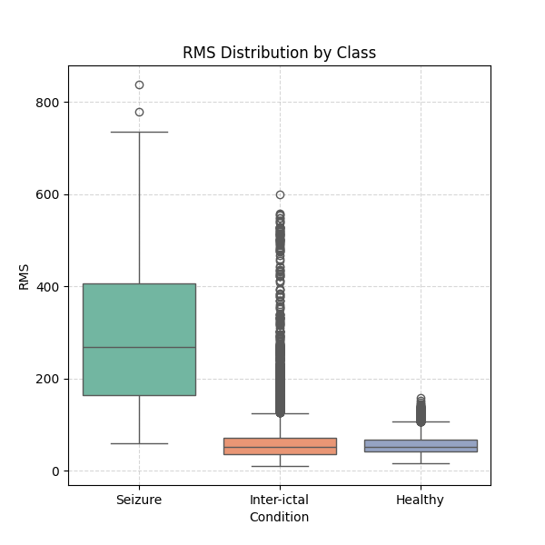
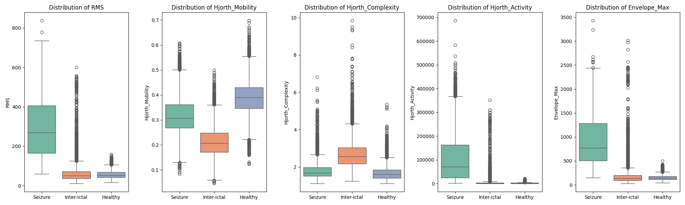

# Feature Distribution Analysis

## Objective
The goal is to visually verify that the extracted features can discriminate between the three classes:
*   **Healthy**
*   **Inter-ictal** (Epileptic patient, no seizure)
*   **Seizure**

We expect a good feature to have a distinct distribution (Box Plot) for the "Seizure" class compared to the others.

## Results

### 1. RMS (Amplitude) Analysis
The user requested a Box Plot for RMS.

**Observation:**
*   **Seizure (Green/Right)**: The box is positioned significantly higher than Healthy and Inter-ictal.
*   **Separation**: There is minimal overlap between the interquartile range (the box) of Seizure vs Healthy.
*   **Conclusion**: **RMS is an excellent discriminator** for detecting seizures, as they are characterized by high-amplitude synchronized activity.

### 2. Multi-Feature Comparison
We also analyzed the top features identified in Part B (Hjorth Parameters).

**Observations:**
*   **Hjorth Mobility**: Shows very strong separation. Seizure signals have lower mobility (lower mean frequency) but higher variance in mobility compared to healthy signals.
*   **Hjorth Complexity**: Also shows distinct ranges.
*   **Envelope Max**: Similar to RMS, shows clear separation for Seizure events.

## Summary
The visual analysis confirms that the extracted features (RMS, Hjorth, Envelope) are not just theoretical quantities but have **strong discriminative power**. They effectively separate the "Seizure" class from "Healthy" and "Inter-ictal" states, justifying their use in the machine learning model.
