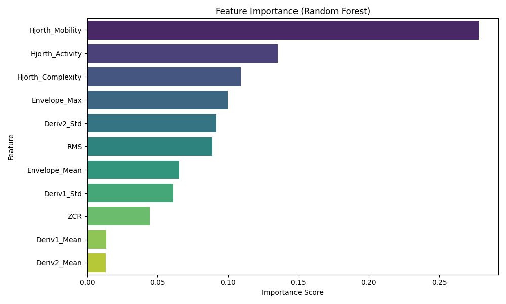

# Feature Importance Analysis

## Objective
The goal is to understand which of the 11 extracted features contributes most to the detection of seizures (classification between Healthy, Inter-ictal, and Seizure states).
This helps in:
1.  **Interpretability**: Understanding what drives the model's decisions.
2.  ** dimensionality Reduction**: Identifying irrelevant features that can be removed.

## Methodology
We trained a **Random Forest Classifier** (`n_estimators=100`) on the **Training Set**. Random Forest provides an intrinsic measure of feature importance based on "Gini Impurity" reduction (how much each feature helps to split the data cleanly).

## Results

### Ranking (Top Drivers)
| Rank | Feature | Importance | Interpretation |
| :--- | :--- | :--- | :--- |
| **1.** | **Hjorth_Mobility** | **~27.8%** | Surprisingly, the *frequency content* (Mobility = mean frequency) is the strongest predictor, more than raw amplitude. |
| **2.** | **Hjorth_Activity** | **~13.5%** | This represents signal variance/power. Expected to be high for seizures. |
| **3.** | **Hjorth_Complexity** | **~10.9%** | Change in frequency. Seizures often have chaotic frequency shifts. |
| **4.** | **Envelope_Max** | **~10.0%** | Peak amplitude. |
| **5.** | **Deriv2_Std** | **~9.1%** | High frequency noise/spikes. |

### Observations
*   **Hjorth Parameters are Dominant**: The top 3 include all Hjorth parameters. This suggests that the *spectral properties* (frequency/shape) of the EEG are more distinctive than simple amplitude statistics for distinguishing the 3 classes (especially differentiating Healthy vs Inter-ictal).
*   **RMS vs Envelope**: RMS is ranked 6th (~8.8%). This might be because `Hjorth_Activity` (Rank 2) captures similar variance information (Correlation > 0.95), and the Random Forest Split the importance between them.
*   **Low Importance**: `Deriv1_Mean` and `Deriv2_Mean` are effectively noise (~1%). They likely average out to zero for oscillatory signals.

## Conclusion
For a "lightweight" model, one could potentially use just the **Hjorth Parameters** (Activity, Mobility, Complexity) and achieve high accuracy, dropping 8 other features. The "Derivative Means" are safe candidates for removal.
