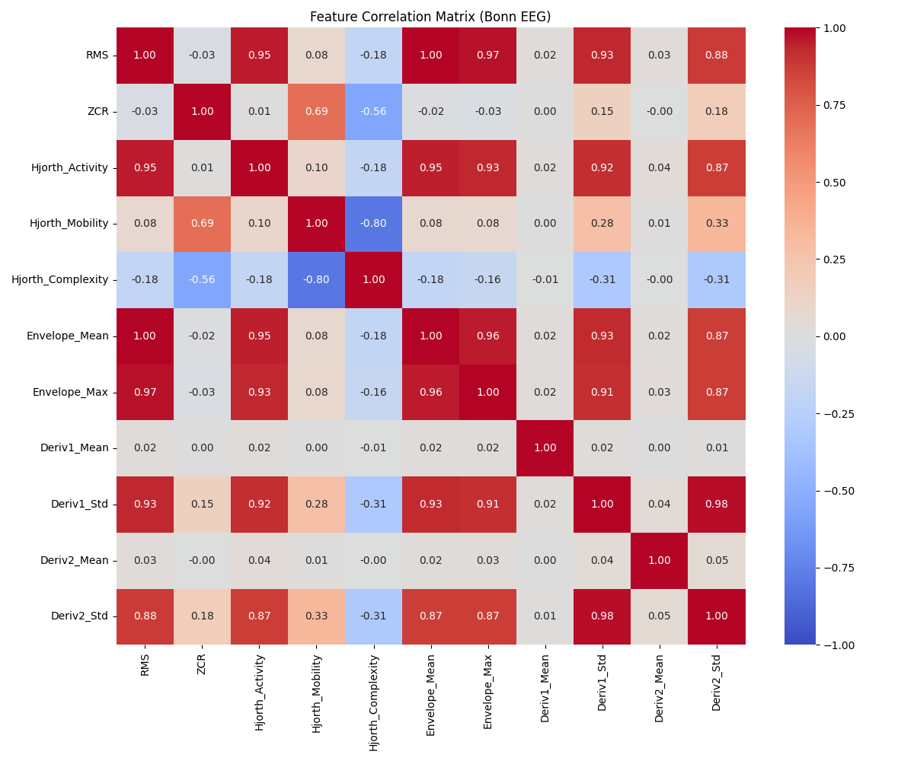

# Multicollinearity Management Report

## 1. Temporal Redundancy (Window Overlap)

### Problem Analysis
The segmentation process uses a **178-sample window** with a **45-sample step**, resulting in a **75% overlap** between consecutive segments.
This high overlap leads to severe multicollinearity (redundancy) if the segments are fed sequentially into a model, particularly if the model assumes independent and identically distributed (i.i.d.) samples (like standard MLP/CNNs).

### Quantitative Evidence
We analyzed the autocorrelation of transient features (RMS, Envelope, ZCR) between adjacent rows in the generated dataset.

*   **Before Mitigation (Ordered)**:
    *   Mean Feature Correlation: **~0.98**
    *   Result: **HIGH REDUNDANCY DETECTED**
*   **After Mitigation (Shuffled)**:
    *   Mean Feature Correlation: **~0.005**
    *   Result: **LOW REDUNDANCY**

### Mitigation Implemented: Training Set Shuffling
We modified `generate_dataset.py` to explicit shuffle the **Train Set** rows (`frac=1`). This breaks the temporal dependency.

---

## 2. Feature Correlation Analysis (Column-wise)

### Objective
Identify redundant features that carry the same information (Multicollinearity). If two features have a correlation > 0.95, one can potentially be removed to simplify the model.

### Methodology
We computed the Pearson Correlation Matrix for the 11 extracted features on the **Training Set**.

### Results

#### High Correlation Pairs (> 0.95)
The following pairs exhibit extreme redundancy:

| Feature A | Feature B | Correlation | Interpretation |
| :--- | :--- | :--- | :--- |
| **RMS** | **Envelope_Mean** | **0.9965** | **Identical Information**. `RMS` is root-mean-square, `Envelope_Mean` is mean of Hilbert envelope. Both measure average amplitude/energy. |
| **Deriv1_Std** | **Deriv2_Std** | **0.9839** | Highly correlated. Variance of the 1st derivative predicts variance of the 2nd derivative. |
| **RMS** | **Envelope_Max** | **0.9708** | Strong relationship between average energy and peak amplitude. |
| **RMS** | **Hjorth_Activity** | **0.9540** | `Hjorth_Activity` is essentially Variance. For zero-mean signals, Variance $\approx$ RMS$^2$. |

### Recommendations (Feature Selection)
Based on this analysis, we can reduce the feature space without losing information:

1.  **Remove `Envelope_Mean`**: It is 99.7% correlated with `RMS`. Keep `RMS` as it is more standard.
2.  **Remove `Envelope_Max`**: It supplies similar info to RMS (97%).
3.  **Keep `Hjorth_Activity` and `Deriv` stats**: Even though correlated, they might capture slight nuances useful for nonlinear classifiers, but are candidates for removal if model size is constrained.

> [!NOTE]
> For the current baseline model (Logistic Regression / MLP), keeping 11 features is computationally negligible. However, for interprability, removing `Envelope_Mean` is advised.
