# Use Case Diagram - EEG Analysis System

## Mermaid Diagram

```mermaid
graph TB
    subgraph System["EEG Analysis System"]
        %% Student Use Cases
        UC1["Register / Login"]
        UC2["Upload EEG Record"]
        UC3["Analyze EEG Record"]
        UC4["View Risk Assessment"]
        UC5["View Feature Contributions"]
        UC6["Add Student Notes"]
        UC7["View Instructor Feedback"]
        
        %% Instructor Use Cases
        UC8["View Student Analyses"]
        UC9["Add Instructor Feedback"]
        UC10["View Patient Dashboard"]
        UC11["Analyze Patient EEG"]
        UC12["View Risk-Based Patient Ranking"]
        UC13["Add Clinical Notes"]
        UC14["Review Patient History"]
        
        %% Admin Use Cases
        UC15["Manage Users"]
        UC16["Assign Roles"]
        UC17["Manage System Settings"]
        
        %% ML Model Use Cases
        UC18["Process EEG Data"]
        UC19["Process Real-Time Sensor Stream"]
        UC20["Return Risk Score"]
        UC21["Return Feature-Level Explanation"]
    end
    
    %% Actors
    Student[Студент]
    Instructor[Преподавател / Лекар]
    Admin[Администратор]
    MLModel[ML Модел]
    
    %% Student Associations
    Student --> UC1
    Student --> UC2
    Student --> UC3
    Student --> UC4
    Student --> UC5
    Student --> UC6
    Student --> UC7
    
    %% Instructor Associations
    Instructor --> UC8
    Instructor --> UC9
    Instructor --> UC10
    Instructor --> UC11
    Instructor --> UC12
    Instructor --> UC13
    Instructor --> UC14
    
    %% Admin Associations
    Admin --> UC15
    Admin --> UC16
    Admin --> UC17
    
    %% ML Model Associations
    UC18 --> MLModel
    UC19 --> MLModel
    UC20 --> MLModel
    UC21 --> MLModel
    
    %% Dependencies
    UC3 -.->|uses| UC18
    UC3 -.->|uses| UC20
    UC3 -.->|uses| UC21
    UC11 -.->|uses| UC18
    UC11 -.->|uses| UC20
    UC11 -.->|uses| UC21
    UC4 -.->|uses| UC20
    UC5 -.->|uses| UC21
    UC12 -.->|uses| UC20
    
    style System fill:#e1f5ff,stroke:#01579b,stroke-width:2px
    style Student fill:#fff9c4,stroke:#f57f17,stroke-width:2px
    style Instructor fill:#fff9c4,stroke:#f57f17,stroke-width:2px
    style Admin fill:#fff9c4,stroke:#f57f17,stroke-width:2px
    style MLModel fill:#fff9c4,stroke:#f57f17,stroke-width:2px
```

## Описание на Use Cases

### За Студент

1. **Register / Login** - Регистрация и влизане в системата
2. **Upload EEG Record** - Качване на EEG запис
3. **Analyze EEG Record** - Анализ на EEG запис (използва ML модела)
4. **View Risk Assessment** - Преглед на оценка на риска
5. **View Feature Contributions** - Преглед на приноса на характеристиките
6. **Add Student Notes** - Добавяне на бележки от студента
7. **View Instructor Feedback** - Преглед на обратна връзка от преподавател

### За Преподавател / Лекар

1. **View Student Analyses** - Преглед на анализи на студенти
2. **Add Instructor Feedback** - Добавяне на обратна връзка от преподавател
3. **View Patient Dashboard** - Преглед на табло за пациент
4. **Analyze Patient EEG** - Анализ на EEG на пациент (използва ML модела)
5. **View Risk-Based Patient Ranking** - Преглед на класиране на пациенти по риск
6. **Add Clinical Notes** - Добавяне на клинични бележки
7. **Review Patient History** - Преглед на история на пациент

### За Администратор

1. **Manage Users** - Управление на потребители
2. **Assign Roles** - Присвояване на роли
3. **Manage System Settings** - Управление на системни настройки

### За ML Модела

1. **Process EEG Data** - Обработка на EEG данни
2. **Process Real-Time Sensor Stream** - Обработка на поток от сензори в реално време
3. **Return Risk Score** - Връщане на оценка на риска
4. **Return Feature-Level Explanation** - Връщане на обяснение на ниво характеристики

## Зависимости

- **Analyze EEG Record** използва:
  - Process EEG Data
  - Return Risk Score
  - Return Feature-Level Explanation

- **Analyze Patient EEG** използва:
  - Process EEG Data
  - Return Risk Score
  - Return Feature-Level Explanation

- **View Risk Assessment** използва:
  - Return Risk Score

- **View Feature Contributions** използва:
  - Return Feature-Level Explanation

- **View Risk-Based Patient Ranking** използва:
  - Return Risk Score

